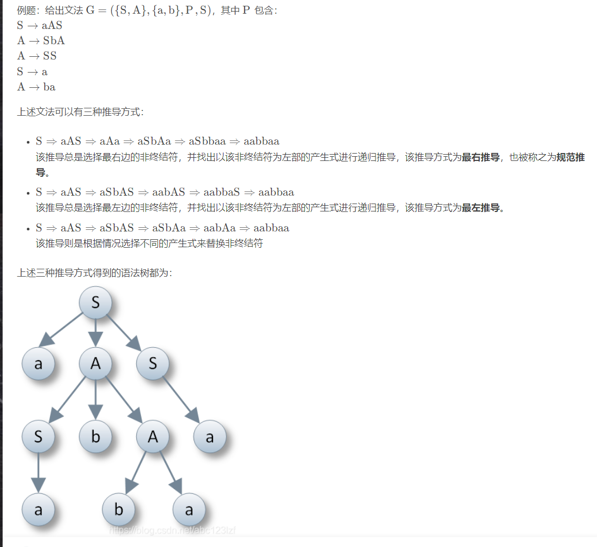

### 一个文法可以表述为 G = (VT,VN,P,S)

+ VT为终结符

+ VN为非终结符

+ P为产生式

+ S为开始符号

### 何为终结符？在编程语言中，终结符可以理解为不能再进行拆分的基本符号，例如C语言中的if、else、while关键字，也可以是一个变量名、数字。

### 和终结符相反，非终结符就是可以再进行拆分的符号，它可以推出其它的语法成分。如果要对一个非终结符进行语法分析，就需要对它需要进行递归分析。在C语言的if-else文法中，if或者else后面跟着的代码块可以看成是非终结符。

### 文法分为四种，分别是0型、1型、2型、3型文法
+ 0型文法是短语文法

**简单来说就是对产生式无具体限制,并且只要左侧是一个非终结符，则右侧可以为任意形式的字符，甚至可以无限递归循环**

+ 1型文法是上下文有关文法

**1型文法除了要求必须有一个非终结符，产生式左边的元素个数也必须少于或等于右边的元素个数**

+ 2型文法是上下文无关文法

**2型文法在1型文法的基础上，要求产生式的左边只可以为一个非终结符**

+ 3型文法是正规文法

**3型文法其产生式的左侧是一个非终结符号，右侧要么是一个终结符号，要么是一个非终结符号加上一个终结符号。**

#### 语法树

**对于给定的文法,总能构造出与之对应的语法树，对于不产生式顺序的使用，能够得到一颗完整的语法树，一个非二义性的文法应该只有一个语法树**

